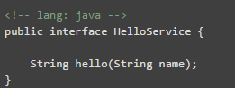

# zdy-rpc
zdy的私人rpc通讯框架

## 简介
zdy-rpc通讯框架是服务于中大型项目的远程过程调用框架。基于dubbo的二次开发，适用于想摆脱dubbo沉重通讯配置的工程。 优点:配置简单，基于dubbo核心，具有服务注册，服务发现，动态兼容版本，负载均衡等核心功能。基于zookeeper通讯协议进行服务管理。 缺点:不支持服务治理。

## 使用手册
暂无

## pom依赖
\<dependency> 
    \<groupId>com.github.zdylalala\</groupId> 
    \<artifactId>zdy-rpc\</artifactId> 
    \<version>1.0-RELEASE\</version> 
\</dependency> 

## 技术支持
邮箱: 395751951@qq.com
根据开发者实际情况提供技术支持。
## 版权所有
开源免费。

## 项目讲解
该讲解基于熟练掌握dubbo框架的使用的前提下。作者水平有限。常识与细节不与过多描述。
### 1 编写服务接口(被provider和customer共同依赖。)

### Check out sources
`git clone git@github.com:spring-projects/spring-framework.git`

### Import sources into your IDE
Run `./import-into-eclipse.sh` or read `import-into-idea.md` as appropriate.
> **Note:** Per the prerequisites above, ensure that you have JDK 8 configured properly in your IDE.

### Install all spring-\* jars into your local Maven cache
`./gradlew install`

### Compile and test; build all jars, distribution zips, and docs
`./gradlew build`

... and discover more commands with `./gradlew tasks`. See also the [Gradle
build and release FAQ][].

## Contributing
[Pull requests][] are welcome; see the [contributor guidelines][] for details.

## Staying in Touch
Follow [@SpringCentral][] as well as [@SpringFramework][] and its [team members][]
on Twitter. In-depth articles can be found at [The Spring Blog][], and releases
are announced via our [news feed][].

## License
The Spring Framework is released under version 2.0 of the [Apache License][].

[Spring Integration]: https://github.com/spring-projects/spring-integration
[Spring Batch]: https://github.com/spring-projects/spring-batch
[family of projects]: http://spring.io/projects
[Spring organization]: https://github.com/spring-projects
[downloading Spring artifacts]: https://github.com/spring-projects/spring-framework/wiki/Downloading-Spring-artifacts
[building a distribution with dependencies]: https://github.com/spring-projects/spring-framework/wiki/Building-a-distribution-with-dependencies
[Javadoc]: http://docs.spring.io/spring-framework/docs/current/javadoc-api/
[reference docs]: http://docs.spring.io/spring-framework/docs/current/spring-framework-reference/
[spring tags]: http://spring.io/questions
[Stack Overflow]: http://stackoverflow.com/faq
[Commercial support]: http://spring.io/services
[Spring Framework JIRA]: https://jira.spring.io/browse/SPR
[the lifecycle of an issue]: https://github.com/spring-projects/spring-framework/wiki/The-Lifecycle-of-an-Issue
[spring-framework-issues]: https://github.com/spring-projects/spring-framework-issues#readme
[readme]: https://github.com/spring-projects/spring-framework-issues#readme
[Gradle]: http://gradle.org
[`./gradlew`]: http://vimeo.com/34436402
[Git]: http://help.github.com/set-up-git-redirect
[JDK8 build]: http://www.oracle.com/technetwork/java/javase/downloads
[Gradle build and release FAQ]: https://github.com/spring-projects/spring-framework/wiki/Gradle-build-and-release-FAQ
[Pull requests]: https://help.github.com/categories/collaborating-on-projects-using-issues-and-pull-requests/
[contributor guidelines]: https://github.com/spring-projects/spring-framework/blob/master/CONTRIBUTING.md
[@SpringFramework]: https://twitter.com/springframework
[@SpringCentral]: https://twitter.com/springcentral
[team members]: https://twitter.com/springframework/lists/team/members
[The Spring Blog]: http://spring.io/blog/
[news feed]: http://spring.io/blog/category/news
[Apache License]: http://www.apache.org/licenses/LICENSE-2.0
