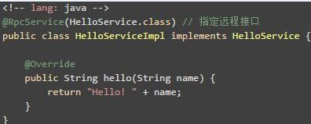
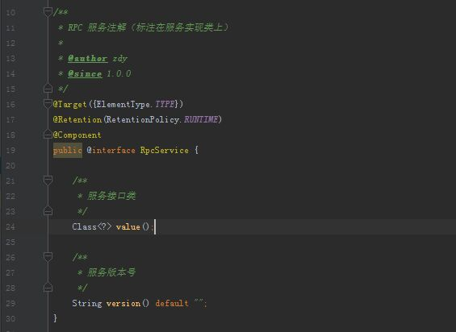
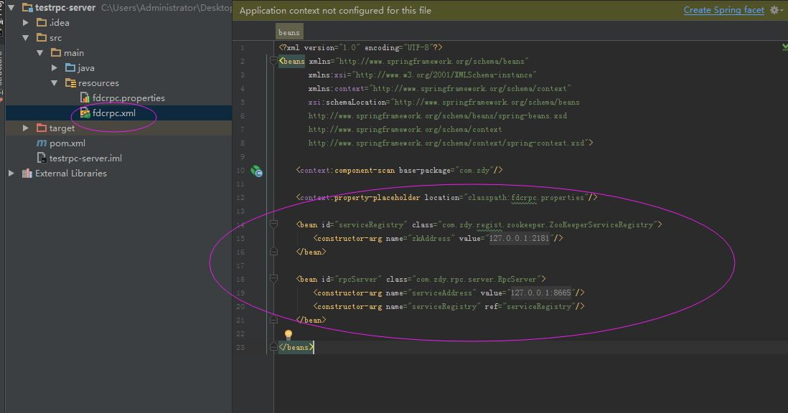
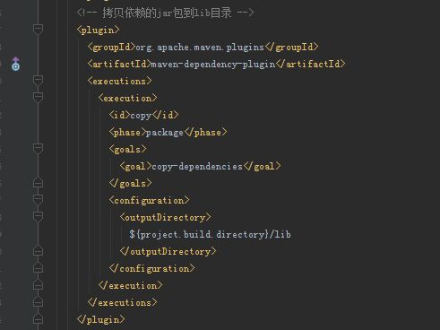
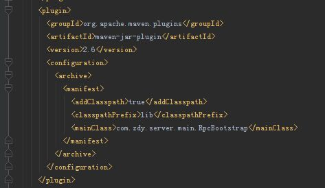

# zdy-rpc
zdy的私人rpc通讯框架

## 简介
zdy-rpc通讯框架是服务于中大型项目的远程过程调用框架。基于dubbo的二次开发，适用于想摆脱dubbo沉重通讯配置的工程。 优点:配置简单，基于dubbo核心，具有服务注册，服务发现，动态兼容版本，负载均衡等核心功能。基于zookeeper通讯协议进行服务管理。 缺点:不支持服务治理。

## 使用手册
暂无

## pom依赖
\<dependency> 
    \<groupId>com.github.zdylalala\</groupId> 
    \<artifactId>zdy-rpc\</artifactId> 
    \<version>1.0-RELEASE\</version> 
\</dependency> 

## 技术支持
邮箱: 395751951@qq.com
根据开发者实际情况提供技术支持。
## 版权所有
开源免费。

## 项目讲解
该讲解基于熟练掌握dubbo框架的使用的前提下。作者水平有限。常识与细节不与过多描述。
### 1 编写服务接口(被provider和customer共同依赖。)

### 2.0 编写服务提供方，接口的实现，provider
 
这里的注解为自定义注解，框架实现。表明该接口注册到zookeeper中。 
RpcService实现如下: 
 

### 2.1  provider所需要的配置
 

maven工程下的资源路径(resources)下需要有fdcrpc.xml配置文件，且其中有RpcServer和Regist的显示注入。
maven的主pom文件中需要有:
 
 具体原因参考dubbo启动原理。

### 2.2 provider注册
在server工程下mvn clean install后:java -jar jar包名即可.

